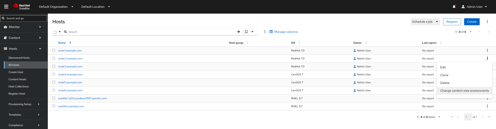
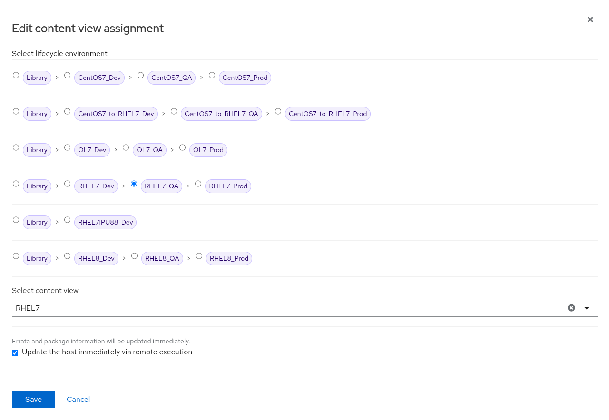
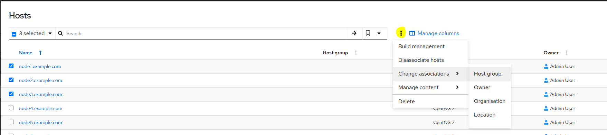
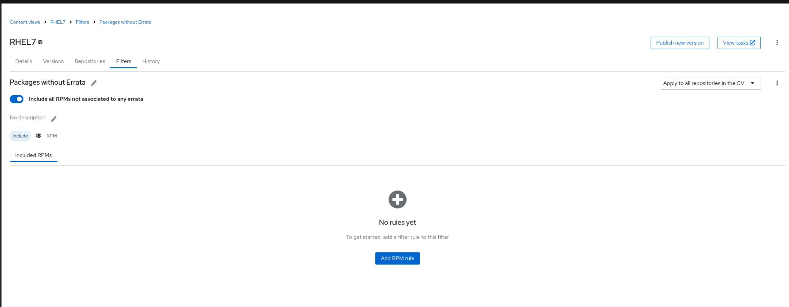

# Deploying the Environment

[Lab original instructions](https://github.com/ansible/workshops/tree/devel/exercises/rhdp_auto_satellite)

[New Lab Instructions](https://github.com/ansible/workshops/tree/devel/exercises/rhdp_auto_satellite)
## RHPDS

1. Log in to the [Red Hat Demo Platform](https://demo.redhat.com)
2. In the catalog, search for "Ansible Workshop - Automated Satellite Workshop"
3. Select Activity "Practice/Enablement" and Purpose "Learning about the product"
4. Fill out the other values before submitting
5. Wait for the workshop to deploy
6. You will receive an email to say that your workshop is ready
7. Follow the last link to manage your RHDP service
8. From here you can access the intructions, each of the applications (VS Code, AAP, Satellite, RHEL Web Console), and instructions to ssh into the Linux Developer Host (ssh student@ansible-[workshop-name].opentlc.com)
9. Note the workbench SSH user, likely to be student, and the workbench password
10. Note the admin user and matching password too

This deploys an AAP version 2.4, Satellite version 6.18 with 3 RHEL 7.9 hosts

# Prepare Satellite and the RHEL nodes using AAP Controller

The RHEL nodes are already created with the configuration:
- Nodes 1,2,3 exist on the RHEL7_Dev Life Cycle Environment
- Nodes 4,5,6 exist on the CENTOS7_Dev Life Cycle Environment

### Configure Environment
We want nodes 1,2,3 to be part of separate Lifecycle Environments
<!--
Not Currently Working -- Automation step 1. Set Node2 to QA, and Node3 to Prod:
#### 1. In AAP create a Job Template with the following paramaters and then launch it
- **Name:** DEMO Satellite Prepare Lifecycle Environments
- **Inventory:** Workshop Inventory
- **Project:** DEMO Satellite Demo Config
- **Execution Environment:** auto_satellite workshop execution environment
- **Playbook:** AAP-prep.yml
- **Credentials:**
    - Credential Type: Machine
    - Credential Name: Workshop Credential
    - Credential Type: Satellite_Collection
    - Credential Name: Satellite Credential
- **Privilege escalation:** yes (even if possibly redundant as it's in the playbook)
- **Save**
- *Launch the template* -->

#### 1. Set Node2 to QA, and Node3 to Prod:
1. Go to Hosts -> All Hosts
2. Select the three dots on the far right for **node2.example.com** and select **Change content view environments**

3. Select **RHEL7_QA**
4. Select the **RHEL7** content view
5. Check the box labelled **Update the host immediately via remote execution**

6. Do the same for node3 ensuring to select **RHEL7_Prod**

---

#### 2. Next we need to update the inventories of these sources
1. Login to the AAP Console
2. Go to Resources -> Templates
3. Select the **CONTROLLER / Update inventories via dynamic sources** template
4. Launch Job
5. Select the **RHEL7** inventory in the first box
6. Select the **Dev** Environment in the second box
7. Run the Job
8. Repeat steps 2-7 selecting the **QA** Environment in the second box of the template
9. Repeat steps 2-7 selecting the **Prod** Environment in the second box of the template

---

### Configure Environment with Automation
#### 1. Add a new project with the following parameters:
- **Name:** DEMO Satellite Demo Config
- **Source Control Type:** GIT
- **Source Control URL:** https://github.com/benblasco/satellite_demo_config.git    
- **Branch:** main
- **Options:** Clean; Update Revision on Launch

---

#### 2. Prepare AAP for remote execution by creating an AAP job template with the following parameters and then launching it:
- **Name:** DEMO Set PythonWarnings
- **Inventory:** Workshop Inventory
- **Project:** DEMO Satellite Demo Config
- **Execution Environment:** Default execution environment
- **Playbook:** aap_set_python_warnings.yml
- **Credentials:**
    - **Credential type:** Red Hat Ansible Automation Platform
    - **Credential Name:** Controller Credential
    - **Credential type:** Machine
    - **Credential Name:** Workshop Credential
- **Privilege escalation:** yes (even if possibly redundant as it's in the playbook)
- *Launch the template*

---

#### 3. Configure Satellite Remote Execution by creating an AAP job template with the following parameters and then launching it:
- **Name:** DEMO Satellite Remote Execution
- **Inventory:** Workshop Inventory
- **Project:** DEMO Satellite Demo Config
- **Execution Environment:** auto_satellite workshop execution environment
- **Playbook:** satellite_config_rex.yml
- **Credential type:** Satellite_Collection
- **Credential Name:** Satellite Credential
- **Privilege escalation:** yes (even if possibly redundant as it's in the playbook)
- *Launch the template*

---

#### 4. Enable RHEL Remote Execution by creating an AAP job template with the following parameters and then launching it:
- **Name:** DEMO RHEL Remote Execution
- **Inventory:** Workshop Inventory
- **Project:** DEMO Satellite Demo Config
- **Execution Environment:** auto_satellite workshop execution environment
- **Playbook:** rhel_configure_rex.yml
- **Credential type:** Machine
- **Credential Name:** Workshop Credential
- **Limit:** rhel7 (case sensitive)
- **Privilege escalation:** yes
- *Launch the template*

---

#### 5. Install RHEL System Roles in Satellite by creating an AAP job template with the following parameters and then launching it
**Note:** This requires a RHEL activation key and organisation ID, both of which can be retrieved from your account via https://console.redhat.com/insights/connector/activation-keys.  It will register the system, install the roles, and then immediately unregister the system. 

- **Name:** DEMO Satellite Install System Roles
- **Inventory:** Workshop Inventory
- **Project:** DEMO Satellite Demo Config
- **Execution Environment:** auto_satellite workshop execution environment
- **Playbook:** satellite_install_system_roles.yml
- **Credentials:**
    - Credential Type: Machine
    - Credential Name: Workshop Credential
    - Credential Type: Satellite_Collection
    - Credential Name: Satellite Credential
- **Privilege escalation:** yes (even if possibly redundant as it's in the playbook)
- **Add the following variables:**
```
---
rhn_activation_key: <Activation key>
rhn_org_id: <Organisation ID>
```
- **Save**
- *Launch the template*

---

#### ~~6. Configure RHEL host groups and collections by creating an AAP job template with the following parameters and then launching it~~ 
### Currently not automated -- Move to Step 7 for the manual steps
- **Name:** DEMO Satellite Configure RHEL hosts
- **Inventory:** Workshop Inventory
- **Project:** DEMO Satellite Demo Config
- **Execution Environment:** smart_mgmt workshop execution environment
- **Playbook:** satellite_config_hosts.yml
- **Credential Type:** Satellite_Collection
- **Credential Name:** Satellite Credential
- **Privilege Escalation:** yes

**Note:** You will need to manually add the relevant hosts to the created host groups and host collections, as this has not yet been automated

---

#### 7. (Manual Steps for Step 6.) Configure Host Collection and Host Group for RHEL Machines
- In Satellite webui go to Hosts -> Host Collections
- Create Host Collection
    - **Name:** All RHEL Hosts Collection
    - **Save**
- Select **ALL RHEL Hosts Collection**
    1. Go to Hosts
    2. Click Add
    3. Select nodes 1,2,3
    4. Click Add Selected
- Go to Configure -> Host Groups
- Create Host Group
    - **Name:** All RHEL hosts host group
    - **Submit**
- Add hosts to the group
    1. Go to Hosts -> All Hosts
    2. Select all RHEL hosts (nodes 1,2,3)
    3. Click the 3 dot burger-menu beside the Search Bar -> Change associations -> Host Group
    
    4. Select **All RHEL hosts group** from the drop down
    5. **Save**
    6. Check that all RHEL hosts belong to the correct group (see Host Group column)

#### 8. Set up Lightspeed (fka Insights) integration
- Follow the steps outlined at [Automated Satellite Workshop: Insights Environment Setup](https://github.com/ansible/workshops/blob/devel/exercises/rhdp_auto_satellite/5-setupinsights/README.md) to connect the RHEL hosts to connect hosts to Lightspeed at console.redhat.com

#### 9. Continue with any other configurations you want to perform as per the workshop instructions


## Config in Satellite

### Synchronise the repositories

1. Navigate to Content -> Sync Status -> Red Hat Enterprise Linux Server -> 7Server -> x86_64
2. Tick **Red Hat Enterprise Linux 7 Server RPMs x86_64 7Server** and **Red Hat Enterprise Linux 7 Server - Extras RPMs x86_64**
3. Click the "Synchronise Now" button to pull the latest content.

### Create a new version of the Content View (CV) for each lifecycle environment (LCE)

Note: This is based on the knowledge shared in this comment within a KB article [https://access.redhat.com/discussions/2913231#comment-1148661](https://access.redhat.com/discussions/2913231#comment-1148661).  Please make it a priority to read this article before proceeding.  

1. Go to Content -> Lifecycle -> Content Views
2. Select RHEL7
3. Go to Filters
4. Create Filter
    - **Name:** Packages without Errata
    - **Content Type:** RPM
    - Leave the Include filter checked
5. Check the slider for *Include all RPMS not associated to any errata*

6. Go back to the *Filters* page
7. Create Filter
    - **Name:** Errata to 31-12-2023
    - **Content Type:** Errata - by date range
    - Leave the Include filter checked
8. On the **Errata to 31-12-2023** page
    - Enter an end date of: **12/31/2023**
    - Save
9. Publish New Version
    - Tick **Promote** slider and click **Next**
    - Select the **RHEL7_Prod** Lifecycle Environment
    - Click **Next**
    - Click **Finish**
    - *This will take some time*, perhaps 10 minutes or more.

#### Edit the 'Errata to 31-12-2023' filter with the below:
- Change the name to **Errata to 31-03-2024**
- Change the end date to **03/31/2024** and **save**

Publish New Version
- Tick **Promote** slider and click **Next**
- Select the **RHEL7_QA** Lifecycle Environment
- Click **Next**
- Click **Finish**

#### Edit the 'Errata to 31-03-2024' filter with the below:
- Change the name to **Errata to 30-06-2024**
- Change the end date to **06/30/2024** and **save**

Publish New Version
- Tick **Promote** slider and click **Next**
- Select the **RHEL7_Dev** Lifecycle Environment
- Click **Next**
- Click **Finish**

The final result: you will then have multiple versions of the CV, and each newer version should contain more errata than the previous version.

# Make sure you can show SCAP compliance

Import the foreman-scap-client role as per instructions here

[https://www.redhat.com/en/blog/deploying-openscap-satellite-using-ansible](https://www.redhat.com/en/blog/deploying-openscap-satellite-using-ansible)

# Fix subscription manifest if it goes stale

- Content -> subscriptions
- Manage Manifest -> Refresh

# Pull updates on demand?

Check if you want to pull updates on demand for each repo, or whether you would prefer to keep a downloaded copy for speed and reliability.
